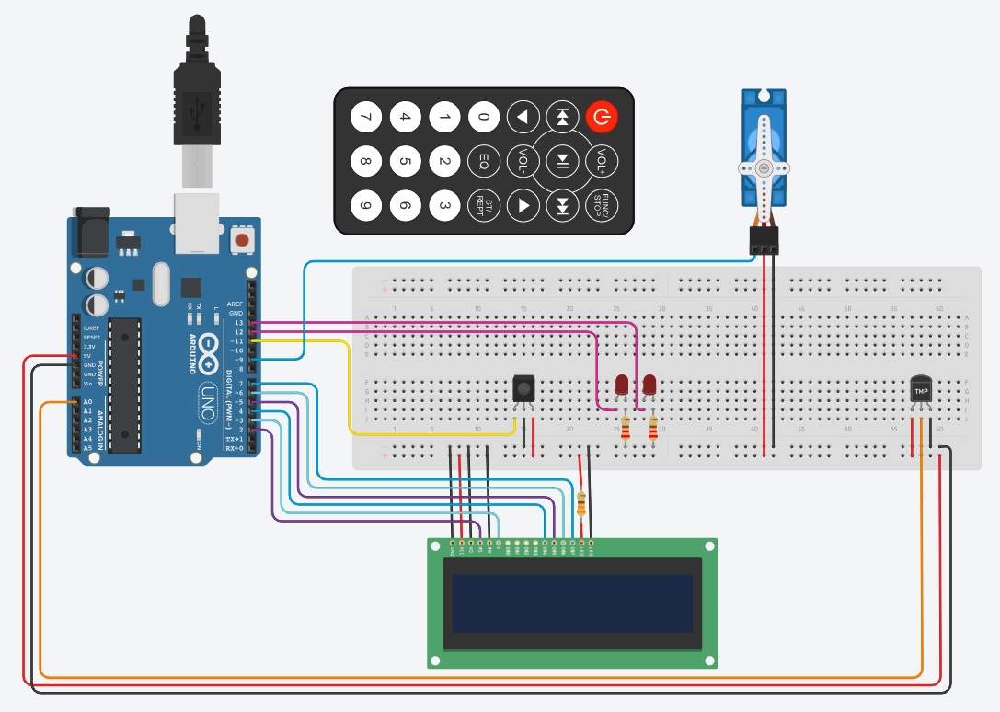
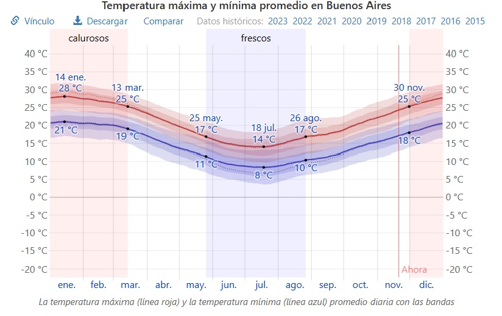

# 2do Parcial.

## Integrante: 
- Tomás León Curto Eivers

## Proyecto: Alarma de Incendios.

## Descripción
DETECTOR DE INCENDIOS QUE MUESTRA LA TEMPERTATURA ACTUAL Y LA ESTACION CALCULADA POR UN ALGORITMO.
A MAS DE 60 GRADOS MUEVE EL SERVO, EL LED DERECHO TITILA Y TITILA LA PALABRA "INCENDIO" EN EL DISPLAY.
TODO EL SISTEMA SE PRENDE Y APAGA CON EL BOTON ROJO DEL CONTROL REMOTO Y LA LUZ LED DE LA IZQUIERDA INDICA SI EL SISTEMA ESTÁ ENCENDIDO.

## Algoritmo: Estacion del año.

## Descripción
EL ALGORITMO TOMA LAS TEMPERATURAS MAYORES A 25 GRADOS COMO VERANO, LAS MENORES A 14 COMO INVIERNO. 
EN LOS RANGOS INTERMEDIOS CHEQUEA SI ESTUVO INCREMENTANDO O DISMINUYENDO PARA SABER SI CONSIDERAR PRIMAVERA U OTOÑO RESPECTIVAMENTE.
EN EL CASO QUE LA TEMPERATURA NO ESTE SUBIENDO NI BAJANDO EN GRAN MEDIDA SE CONSIDERÓ INVIERNO POR DEBAJO DE LOS 18 GRADOS Y VERANO POR ARRIBA.

## Funcion principal
La función de mayor importancia es la que activa la alarma de incendios.

~~~ C++ (lenguaje en el que esta escrito)
void incendio(){
  lcd.setCursor(6, 0);
  lcd.print("INCENDIO");
  digitalWrite(LED2, HIGH);
  delay(500);
  lcd.clear();
  delay(100);
  digitalWrite(LED2, LOW);
  myServo.write(0);
  delay(1000);
}
~~~

## :robot: Link al proyecto
- [proyecto](https://www.tinkercad.com/things/arToBStkHQI-curto-eivers-tomas-leon-segundo-parcial/editel?sharecode=NGX45dwlSzph2015Lbv6MHQdkH3oimtnsG6--4WjOCk)

---
### Fuentes
- [MODELOS DE COFIGO PARA EL CONTROL IR](https://drive.google.com/file/d/1lJVscGSOTJ8lBtmj2kL7tQEty8p89d2G/view).

- [CONEXIONES Y COMANDOS DEL DISPLAY](https://www.youtube.com/watch?v=BOsE7ZEdYU8).
---
